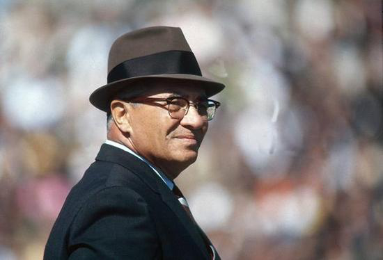

# UILab Fun 02

> Perfection is not attainable, but if we chase perfection we can catch excellence. 

## Learning Objectives - The student should be able to..

* Complete this lab, solidifying what it is they know about this unit and ones prior.

## What the student can do at this point 

* Has a general overview of Xcode and is able to create a new project.
* Knows where to locate the testing file within Xcode.
* Knows how to navigate to Interface Builder.
* Knows what a storyboard file is.
* Has a brief overview of what the Object Library is.
* Can drag a View Controller onto the canvas.
* Can locate and drag items from the Object Library.
* Can locate the Attributes Inspector and change the Background color of Views
* They know how to connect the ViewController.swift file and understand it's view life cycle.
* Can hook up IBOutlets and IBActions.
* Understands UIKit.

## Outline / Notes

*  I think this lab is more about the student solving some simple algorithm where the UI takes more of a backseat. Possibly just dragging over a few labels, buttons to display what it is the function should be spitting back based on certain input. Maybe?? 
* Could also be like the [Simon Says Lab](https://github.com/learn-co-curriculum/swift-outlets-lab) 
* I'm ok with it being simple as well just having them re-create 3-5 ViewControllers. Meaning, we show them 3-5 screenshots where each screenshot reprensts a complete ViewController. We just show them the screenshot and a list of the UI elements that make up that view and it's just on them to drag and drop things and change colors to make it look like the particular view. Too easy?

<a href='https://learn.co/lessons/UILab02' data-visibility='hidden'>View this lesson on Learn.co</a>
